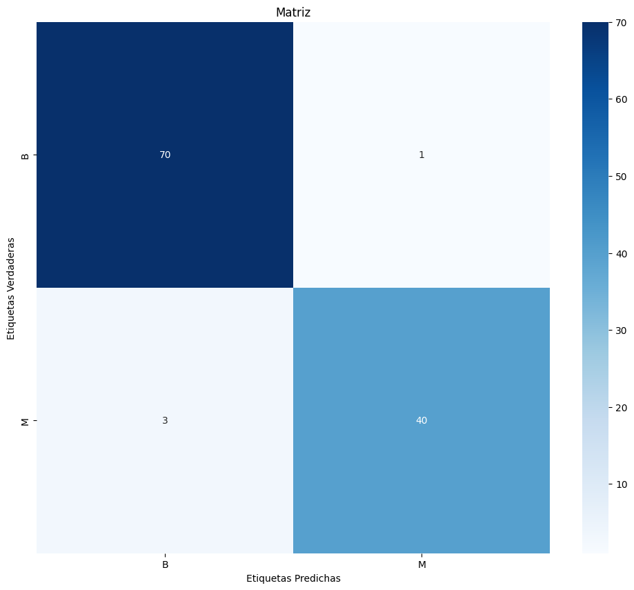
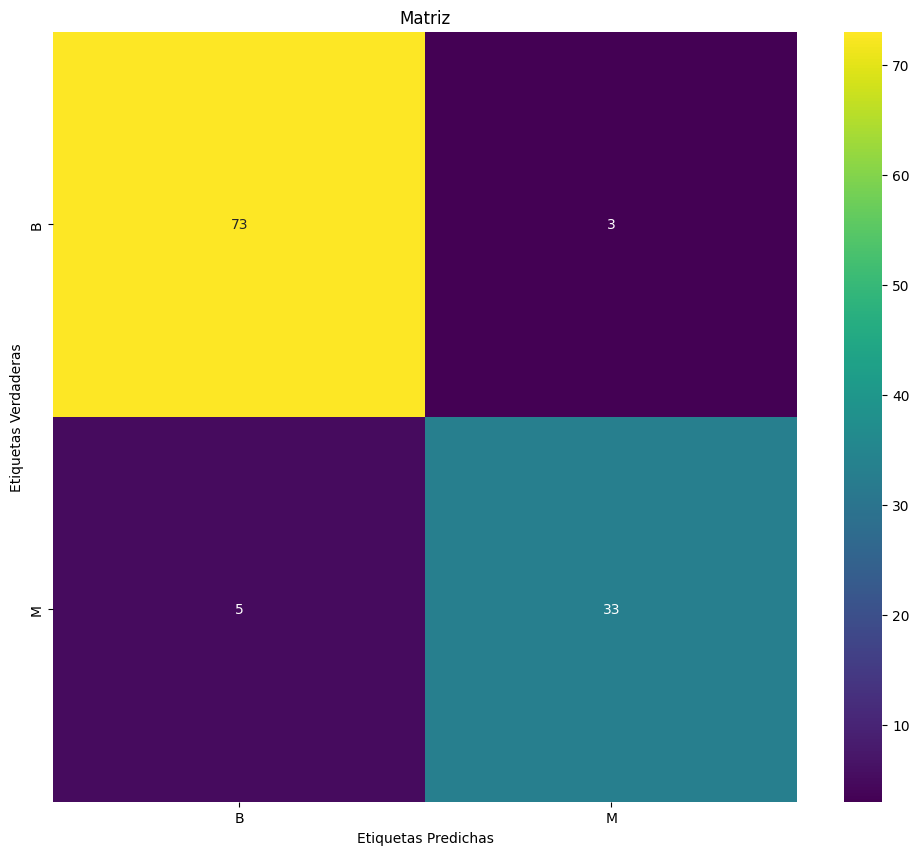
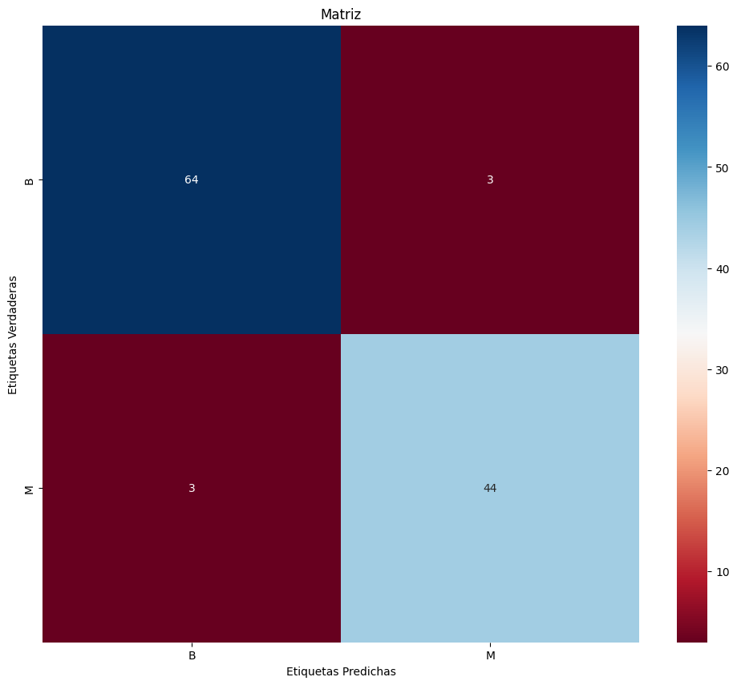

# clase3TareaFina

## Descripción
validación de 3 modelos para el análisis de datos para el dataset de cáncer de mama

## Modelos 
- Algoritmo de aprendizaje RandomForestClassifier
- Algoritmo de aprendizaje LogisticRegression
- Algoritmo de aprendizaje DecisionTreeClassifier

## Procesos y detalles de lo realizado

Para los casos lo primero que se realizo es la obtencion de los datos del dataset del archivo wdbc.data, para este caso no tenia las etiquetas de las columnas, por lo cual se añade al dataset los nombre de las columnas.

Validamos que el dataset este correcto, validando nulos o vacios.

Se elimina la columna ID, la cual no tiene relevancia para el analisis, y puede ser un valor que altere los resultados.

Se procede a cambiar a tipo flotante todas las columnas, excepto Diagnosis.

Se obtiene dos copiar para poder manipular en los modelos de algoritmos.

Para cada modelo se separo el dataset en 2, una parte para test y una para train
    -   Tamaño del conjunto de entrenamiento: 455
    -   Tamaño del conjunto de prueba: 114

Posterior se realiza el entrenamiento y se obtiene los siguientes resultados.

- Para el primer analisis se utilizo el modelo RandomForestClassifier
    -   Precisión del modelo: 96.49%
    -   

- Para el segundo analisis se utilizo el modelo LogisticRegression
    -   Precisión del modelo: 92.98%
    -   

- Para el tercer analisis se utilizo el modelo DecisionTreeClassifier
    -   Precisión del modelo: 94.74%
    -   

## Conclusion
Por lo antes mencionado, el mejor modelo para este caso, es el RandomForestClassifier, el cual es mayor en la preciosion del modelo, aunque el modelo nos da 3 casos Malignos como Benignos, tambien hay que mencionar que es el que mayor numero de malginosy benignas correctos obtuvo.